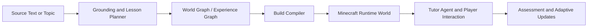
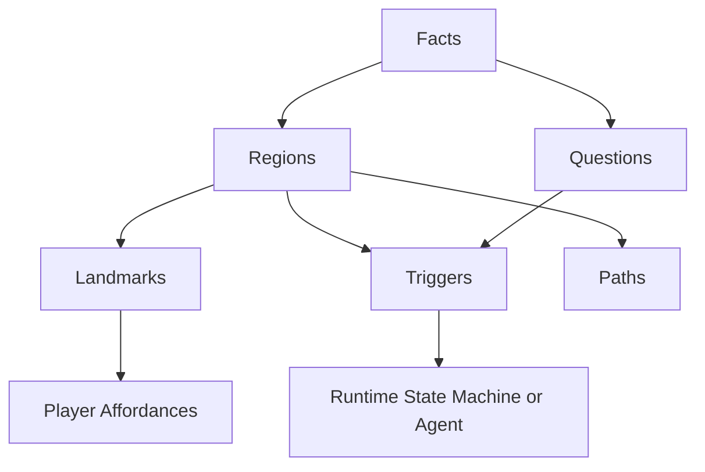

# Refactor Briefing: Unified Minecraft World-Model Agent

Prepared on 2026-03-14 from the local repository state.
Updated on 2026-03-16 after verifying remote branches on GitHub.

## 1. What Exists Right Now

There are four clear implementation tracks across the local clone and remote GitHub branches:

| Track | Evidence | What it is |
| --- | --- | --- |
| `main` | commit `25c9896` | The original TypeScript monorepo: upload -> Gemini planner -> Mineflayer bot -> FSM tutor -> frontend |
| `feature/aqua-roma-hardcoded` | current branch, typechecks cleanly | The most usable demo branch: hardcoded experiences, better UX, prompt visibility, Alexandria flow, session monitor |
| `origin/model_v1_dev` | commit `1a0bd71` | A compact Python planner using `atomic_agents` + Pydantic schemas + Gemini-compatible OpenAI client |
| `aneesh/claude_2` | remote GitHub branch at `d564f94` | A hybrid TypeScript branch that wires the tutor stack to both a direct Gemini world builder and a MinecraftLM-backed builder, plus voice I/O and runtime hardening |

There is also a local reference repo:

- `minecraftlm/` exists on disk but is intentionally not tracked in git.
- It is a separate agentic building system focused on freeform 3D structure generation through code writing, validation, and iterative repair.

Important reality check:

- The original local scan missed Aneesh's work because this clone had not fetched that remote branch.
- GitHub does have `aneesh/claude_2`.
- The remote repo is also ahead of the local clone in other places, so future branch archaeology should use remote refs, not only `git branch -a` in this workspace.

Current health signal:

- `feature/aqua-roma-hardcoded` passes `npm run typecheck`.

## 2. What Each Track Is Good At

### A. Vishnu / `main`

This is the cleanest architectural base.

Strengths:

- Monorepo split into `shared`, `server`, `bot`, `frontend`
- Structured schemas for `ExperiencePackage`, `BuildPlan`, session state, SSE events
- File upload and chapter extraction flow
- Gemini JSON planning with schema validation
- Mineflayer bot runtime
- Finite-state tutor loop
- Clear separation between planning, building, and runtime tutoring

Weaknesses:

- Scene generation is still fairly shallow and template-bound
- The "world model" is implicit, not explicit
- Planner output is decent for demos but not rich enough for robust dynamic generation

### B. Aqua Roma / Alexandria / `feature/aqua-roma-hardcoded`

This is the best demo-delivery branch.

Strengths:

- Hardcoded experiences that actually move through the whole stack
- Better frontend and session monitoring
- Useful prompt surfacing in the UI
- Cleaner demo flow for validating the runtime
- Good regression fixtures: Alexandria can become a golden test world

Weaknesses:

- Hardcoded content can hide architectural problems
- It proves the runtime, but not general on-the-fly generation
- It still depends on a relatively limited planner/builder interface

### C. Simar / `origin/model_v1_dev`

This is the most "research-like" planning track.

Strengths:

- Uses explicit agent abstractions instead of one large planner function
- Has a **topic-context prepass** before final experience planning
- Uses richer schemas: grounding notes, build constraints, symbolic build tokens, trigger rules
- Better separation between factual grounding and creative dramatization
- Closer to a real "Model 1" planner for a future multi-stage pipeline

Weaknesses:

- It is only a planner, not a full runtime
- It lives in Python while the main system is TypeScript
- It creates integration cost if adopted as-is

### D. Aneesh / `aneesh/claude_2`

This is the missing hybrid integration track.

Strengths:

- Keeps the TypeScript monorepo and tutor runtime
- Adds `GeminiDirectBuilder` for command-level world generation
- Adds `MinecraftLMBuilder` as a structure-generation backend
- Makes `SceneBuilder` choose MinecraftLM first, then fall back to direct Gemini
- Adds voice input / TTS routes and frontend voice controls
- Adds better logging, stronger session-id validation, and a more operational `run.sh`
- Treats MinecraftLM as a service rather than a separate experiment

Weaknesses:

- It removes much of the template/walkability layer instead of combining with it
- The direct Gemini builder is ambitious but still fragile because it emits raw `/fill` and `/setblock` command lists
- It increases operational complexity by depending on the MinecraftLM backend in the dev loop
- It is a strong prototype for integration, but not yet the final safe architecture

### E. MinecraftLM Reference Repo

This is the strongest source of ideas for open-ended generation.

Strengths:

- Agent loop with tools
- Code generation instead of only template selection
- Validation and repair cycle
- Evaluation assets and failure analysis
- Much stronger freeform 3D building capability

Weaknesses:

- Open-ended codegen is less reliable than symbolic compilation in a live tutoring loop
- It is optimized for build quality, not educational pacing
- It can fail on block properties, SDK mistakes, or iterative repair loops
- It should not be your only generation strategy for a live classroom demo

## 3. Core Concepts You Need To Reason Clearly

### Agent

An agent is not just "an LLM that talks." In this project, an agent means:

1. It has a goal.
2. It has state or memory.
3. It can observe the world.
4. It can choose actions.
5. It can use tools.
6. It can revise its behavior over multiple steps.

Examples in this repo:

- The tutor bot is an agent, even though it is mostly a scripted FSM.
- The Python `atomic_agents` planner is an agentic planning stage.
- MinecraftLM is a stronger tool-using generation agent that edits code, validates, and retries.

### World Model

A world model is the system's internal understanding of:

- what exists in the Minecraft world
- where things are
- what the player has seen
- what matters pedagogically
- what can happen next

Right now, the codebase has pieces of a world model, but not one unified object.

Those pieces are spread across:

- `ExperiencePackage`
- `BuildPlan`
- FSM memory
- trigger logic
- region centers
- player/objective state

The final system should make this explicit.

### Neurosymbolic Generation

This is the most important design concept for your final version.

In plain language:

- **Neural** part: use Gemini or another model to interpret text, plan scenes, invent metaphors, choose pacing, and map facts to experiences.
- **Symbolic** part: convert that plan into typed objects, constrained build grammar, region graphs, triggers, and deterministic actions.

Good neurosymbolic design means:

- the model decides *what* to teach and *roughly how*
- symbolic systems decide *how it is compiled, validated, and executed*

That is much more reliable than letting a model freely improvise every block in real time.

### Compiler vs Runtime

You should think of the system as two major phases:

1. **Compiler phase**
   Input: chapter/topic
   Output: structured world representation and build instructions

2. **Runtime phase**
   Input: compiled world + live player behavior
   Output: narration, movement, hints, adaptation, objective handling

MinecraftLM blurs these by generating code interactively.
QuizCraft separates them more.
Your final system should keep that separation, but allow some controlled runtime regeneration.

### Grounding

Grounding means making sure the generated world stays connected to source facts.

There are at least three grounding levels:

1. Source grounding: facts from uploaded text or trusted context
2. Spatial grounding: the world is geometrically coherent and walkable
3. Runtime grounding: the bot's dialogue matches the player's actual location and progress

### Affordances

An affordance is something the player can do with a part of the world.

Examples:

- inspect a sign
- place an item on a pedestal
- enter a region
- retrieve an object from a chest
- answer a question after seeing a landmark

Good worlds are not just builds. They are affordance graphs.

## 4. The Best Mental Model For The Final System

Do **not** think of this as "one LLM making a Minecraft world."

Think of it as a five-stage pipeline:

And inside the world graph:

This is the bridge between "historical lesson generator" and "on-the-fly world model."

## 5. Recommended Target Architecture

### Keep the TypeScript monorepo as production base

Use `feature/aqua-roma-hardcoded` as the starting line for the final version because:

- it already passes typecheck
- it has the best end-to-end demo path
- it contains the bot runtime, session plumbing, and UI improvements you need

### Import the planning ideas from `model_v1_dev`, not the whole Python stack

The Python branch has strong ideas, but keeping two production languages will slow you down.

Recommendation:

- port the **schema ideas**
- port the **topic-context prepass**
- port the **grounding fields**
- port the **symbolic build-token concept**
- do **not** keep `atomic_agents` in the critical path unless you truly need it

### Use MinecraftLM as an optional constrained generation worker

This is the highest-leverage hybrid.

Do not use MinecraftLM-style freeform codegen for the entire live system.

Use it only for places where templates are too weak:

- one region at a time
- one landmark at a time
- optional "creative expansion" mode
- offline generation of reusable assets
- evaluation and improvement of prompts

That gives you quality without making the whole runtime fragile.

## 6. The Actual Final Shape I Recommend

### Layer 1: Grounder / Lesson Planner

Input:

- teacher upload or topic

Output:

- `GroundedLessonPlan`

Fields should include:

- source facts
- factual guardrails
- learning objectives
- narrative arc
- region purposes
- question intents
- objective design
- allowed dramatization

This is where Simar's schema ideas belong.

### Layer 2: World Graph

This should become the new central contract.

Suggested shape:

- regions
- paths between regions
- landmarks per region
- affordances per landmark
- trigger rules
- dialogue hooks
- question bindings
- objective state
- player progression states

This should replace the current split-brain feeling between `ExperiencePackage`, `BuildPlan`, and FSM memory.

### Layer 3: Build Compiler

This should turn the world graph into actual geometry.

Use a tiered strategy:

1. Reusable templates for reliable basics
2. Symbolic build grammar for medium complexity
3. Optional constrained codegen for special landmarks

Compiler outputs:

- placement plans
- walkability metadata
- interaction anchors
- validation results

### Layer 4: Runtime Tutor Agent

Keep the current Mineflayer + FSM foundation, but make it world-model-aware.

Instead of only progressing by hardcoded state order, the runtime should read:

- current region
- player position
- trigger satisfaction
- question status
- objective status
- fallback policy

This can still be an FSM, but the transitions should be driven by the world graph.

### Layer 5: Evaluation and Regression

This is where Alexandria and MinecraftLM both help.

Keep:

- hardcoded golden experiences like Alexandria
- sample source texts
- prompt snapshots
- build-plan fixtures
- walkability checks
- session transcripts

You need these to refactor safely.

## 7. What To Keep From Everyone

### Keep from Vishnu

- Monorepo structure
- Typed schemas
- Upload/session/SSE architecture
- Gemini JSON planning integration
- Mineflayer bot runtime
- FSM tutor structure

### Keep from your branch / Aqua Roma branch

- Live demo mentality
- Practical frontend flow
- Hardcoded demos as goldens
- Prompt visibility in the UI
- The instinct to validate the whole loop, not just planning

### Keep from Simar

- Multi-stage planning mindset
- Richer grounding schema
- Explicit constraints
- Separation between topic context and final lesson plan
- Symbolic build-token concept

### Keep from Aneesh

- The hybrid idea: TypeScript runtime + optional MinecraftLM builder
- Builder selection and fallback strategy
- Voice interaction direction
- Better logging and operational hardening
- The instinct to integrate generation systems into the main app instead of leaving them as disconnected prototypes

### Keep from MinecraftLM

- Validator mentality
- Tool-using generation pattern
- Iterative refinement
- Evaluation discipline
- Stronger spatial generation ambitions

### Do not keep as-is

- Duplicate schema vocabularies in different languages
- Freeform codegen in the critical live path
- Hidden hardcoded logic mixed into production planner flow
- Multiple "sources of truth" for session state

## 8. What "On-the-Fly Game Generation World Model" Should Mean

This phrase can go in two very different directions.

### Bad version

"Every frame or every scene is improvised by a large model in real time."

Problems:

- too slow
- too expensive
- too fragile
- hard to debug
- easy to hallucinate impossible builds

### Good version

"The system dynamically expands and adapts a structured world graph during play."

That means:

- regions can be compiled just before the player reaches them
- hints can adapt to what the player has done
- questions can be swapped or rephrased
- landmarks can be upgraded if generation succeeds
- tutoring changes based on the player's behavior

This still feels live, but remains controllable.

## 9. The Refactor Strategy I Would Actually Use

### Phase 1: Stabilize the base

Branch from `feature/aqua-roma-hardcoded`.

Goals:

- keep current app runnable
- keep Alexandria as a golden demo
- freeze current prompts and schemas

### Phase 2: Introduce a new shared world-graph contract

Add a new shared schema, something like:

- `WorldGraph`
- `RegionNode`
- `LandmarkNode`
- `TriggerRule`
- `Affordance`
- `RuntimeBlackboard`

Do this before changing generation logic.

### Phase 3: Upgrade the planner

Replace today's single planner output with:

1. topic/source grounding pass
2. lesson/world-graph planning pass

This is the best place to port ideas from `model_v1_dev`.

### Phase 4: Split building into reliable and creative modes

Two compiler modes:

- `reliable`: template-heavy, demo-safe
- `creative`: uses symbolic grammar and optional codegen for landmark generation

This lets you ship something strong without waiting for perfect freeform generation.

### Phase 5: Make the tutor runtime read from the world model

Instead of encoding special content in custom Alexandria-only state logic, encode:

- region sequence
- trigger conditions
- item affordances
- dialogue hooks
- question unlock rules

in data.

Then the FSM becomes more generic.

### Phase 6: Add evaluation loops

Borrow from MinecraftLM's discipline:

- prompt eval sets
- geometry validation
- block/property validation
- transcript review
- golden worlds

## 10. Concrete First Decisions

If you want the fastest path to a strong final version, these are the right immediate choices:

1. Production base: `feature/aqua-roma-hardcoded`
2. Production language: TypeScript
3. Planner style: multi-stage, grounded, schema-first
4. Builder style: neurosymbolic compiler, not pure freeform codegen
5. Runtime style: Mineflayer FSM backed by a shared world model
6. Creative generation: optional worker, region-scoped, validated
7. Regression strategy: keep Alexandria and at least one chapter-upload flow as goldens

## 11. Biggest Risks

### Risk 1: Trying to merge branches literally

Do not blindly merge all code and hope it converges.
The concepts overlap, but the contracts do not.

### Risk 2: Keeping two production stacks

TypeScript runtime plus Python planner plus optional MinecraftLM worker is too much unless roles are very clear.

### Risk 3: Making the live loop too agentic too early

If every runtime decision becomes open-ended, debugging will become painful.

### Risk 4: No explicit world model

Without a shared world graph, planning, building, and tutoring will keep drifting apart.

### Risk 5: Missing Aneesh's implementation

You may be optimizing around only the code that survived in git.
If his work was genuinely strong, recovering it could change design choices.

## 12. Short Recommendation

Build the final system as:

- a TypeScript monorepo
- with a richer grounded planner inspired by `model_v1_dev`
- a new shared `WorldGraph`
- a neurosymbolic build compiler
- a Mineflayer runtime tutor that reads from that world model
- and an optional MinecraftLM-style generation worker only for constrained creative subproblems

In one sentence:

**Use LLMs to plan and expand the world, but use typed symbolic structures to control, validate, and execute it.**

## 13. Best Next Step After This Briefing

The next highest-value action is not "start refactoring everything."

It is:

1. create a new integration branch from `feature/aqua-roma-hardcoded`
2. define the `WorldGraph` schema
3. map existing `ExperiencePackage`, `BuildPlan`, and FSM state into that schema
4. recover Aneesh's code if possible before deeper architectural decisions

Once that exists, the project will have a real center of gravity.
